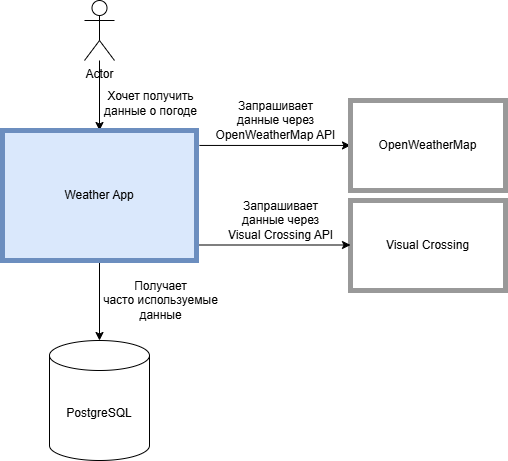
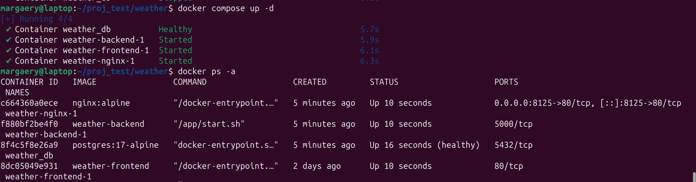

# weather
Участники проекта:
- Быкова Кристина Алексеевна, группа 5130904/20101, роль: `Backend разработчик`
- Кудрявцев Александр Кириллович, группа 5130904/20101, роль: `Тестировщик`
- Чубаров Дмитрий Андреевич, группа 5130904/20101, роль: `Backend разработчик`
- Чурина Маргарита Алексеевна, группа 5130904/20101, роль: `Frontend разработчик`

## Определение проблемы
Пользователи сталкиваются с неудобством при поиске комплексной и наглядной информации о погоде. Существующие метеосервисы часто предоставляют данные о погоде в текущий момент, прогнозе и тд. в разрозненном виде, без удобной визуализации, что затрудняет быстрое восприятие и анализ погодных условий.

## Выработĸа требований
### Пользовательские истории:

| Ситуация (Контекст)         | Потребность (Мотивация)       | Ожидаемый результат                | Решение                              |
|-----------------------------|-------------------------------|------------------------------------|--------------------------------------|
| Перед выходом из дома        | Мгновенно узнать, будут ли осадки | Не взять зонт без необходимости    | Карточка с текущим статусом осадков  |
| Планируя поездку на выходные | Сравнить погоду в разных городах | Выбрать оптимальное место для поездки | Быстрый поиск + графики для разных локаций  |
| Готовясь к тренировке на улице | Оценить ветер и температуру   | Подобрать подходящую экипировку     | Детализированные показатели в карточках |

### Нефункциональные требования:

- Поддержка 10к DAU
- Хранение данных ≥5 лет
- Время отклика API <500 мс (+- 300 мс, зависит от скорости OpenWeatherMap API)
- Доступность 99.9%

## Разработĸа архитеĸтуры и детальное проеĸтирование

### 1. Характеристики нагрузки на сервис

| Параметр          | Значение             | Обоснование                                                                 |
|-------------------|----------------------|-----------------------------------------------------------------------------|
| Соотношение R/W   | 99% Read / 1% Write  | Основная нагрузка — запросы данных. Записи происходят только при кэшировании данных из OpenWeatherMap |
| Суточный трафик   | 1000 запросов/день | ---                                       |
| Пиковая нагрузка  | 200 RPM              | Утро/вечер, проверка погоды перед выходом                                   |
| Объем данных      | 2-5 ГБ/год         | Хранение данных для СПБ с обновлением каждые 15 мин (≈0.5 КБ/запись) |

### 2. Первые две диаграммы из подхода
#### 1. Контекстная диаграмма (C4 Level 1)

#### 2. Контейнерная диаграмма (C4 Level 2)


### 3. Контраĸты API
Контраĸты API описаны в файле `API-documentation.md`.

#### Ожидаемые нефунĸциональные требования на время отĸлиĸа:
- Время ответа API: ≤800 мс
- Доступность: 99.95%
- Лимит запросов: 100 RPM

### 4. Схема базы данных + почему она выдержит нефунĸциональные требования

```
CREATE TABLE public.weather_records (
id SERIAL PRIMARY KEY,
date date NOT NULL,
temperature double precision NOT NULL,
wind_speed double precision NOT NULL,
visibility double precision NOT NULL,
pressure integer NOT NULL,
humidity integer NOT NULL,
city character varying(50) NOT NULL
);
```

#### Производительность
Первичный ключ id SERIAL PRIMARY KEY автоматически создает индекс B-tree, обеспечивая быстрый доступ к записям  
Для 10 дней данных (240 записей) даже полное сканирование таблицы выполняется за миллисекунды  
Простые запросы по дате (WHERE date = ...) эффективны благодаря малому объему данных  

#### Масштабируемость (рост нагрузки в 10 раз)
При 10-кратном увеличении (2,400 записей):  
- Размер таблицы составит ~250KB (100 байт/запись × 2,400)  
- Даже без дополнительных индексов производительность останется приемлемой  
Система может хранить до 2 миллиардов записей — запас огромный  
Возможность быстрого добавления индексов при необходимости

#### Целостность данных
NOT NULL для всех полей гарантирует отсутствие NULL-значений  
PRIMARY KEY предотвращает дублирование записей по id  
Автоматическая валидация типов данных (база сама проверяет, что в графах "температура", "давление" и т.д. — правильные числа)  

#### Доступность (99.9% uptime)
Простая структура — меньше шансов, что что-то сломается  
Нет сложных связей между данными, которые могут вызвать ошибки  
Поддерживает hot-standby репликацию (можно сделать "резервную копию" базы (реплику), которая подхватит работу, если основная база упадет)
    
Эта схема оптимальна для текущих объемов (3-10 дней) и может масштабироваться до 10x нагрузки без изменений. Все критические нефункциональные требования выполняются за счет:
- Минимального объема данных
- Правильно выбранных типов
- Наличия первичного ключа
- Простоты структуры
    
#### Схема БД

    
### 5. Схема масштабирования сервиса при росте нагрузĸи в 10 раз

#### Вертикальное масштабирование (быстрое решение)


#### Действия:

- Увеличение мощности сервера БД: 2→4 CPU, 4→8GB RAM
- Добавление 2-3 реплик API серверов за балансировщиком
- Настройка кэширования для часто запрашиваемых данных

## Кодирование и отладĸа
## Unit тестирование
Для всех компонентов интерфейса написаны Unit тесты. Было решено покрыть тестами именно их, так как это самый удобный способ проверить логику всего приложения.
Для них созданы моки, соответствующие созданному API, чтобы не ждать ответ от сторонних API.  
Тесты можно запустить командой `npm run test`.  
Было решено протестировать именно их, так как бэкенд работает только с БД и сторонними API.
## Интеграционное тестирование
## Сборĸа
1. Для сборки необходимо клонировать себе репозиторий:

2. В директории репозитория необходимо создать `.env` файл, аналогичный `.env.example`.
3. Далее запускаем сборку, Unit тесты и интеграционные тесты командой `docker compose up -d`.

4. Сайтом можно пользоваться на `http://localhost:8125/`,
API доступно по `http://localhost:8125/api`.
