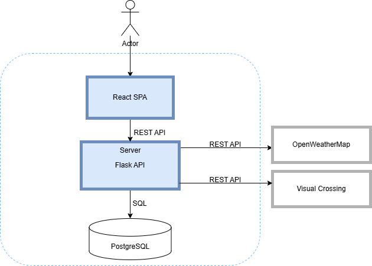

# weather
Участники проекта:
- Быкова Кристина Алексеевна, группа 5130904/20101, роль: `Backend разработчик`
- Кудрявцев Александр Кириллович, группа 5130904/20101, роль: `Тестировщик`
- Чубаров Дмитрий Андреевич, группа 5130904/20101, роль: `Backend разработчик`
- Чурина Маргарита Алексеевна, группа 5130904/20101, роль: `Frontend разработчик`

## Определение проблемы
Пользователи сталкиваются с неудобством при поиске комплексной и наглядной информации о погоде. Существующие метеосервисы часто предоставляют данные о погоде в текущий момент, прогнозе и тд. в разрозненном виде, без удобной визуализации, что затрудняет быстрое восприятие и анализ погодных условий.

## Выработĸа требований
### Пользовательские истории:

| Ситуация (Контекст)         | Потребность (Мотивация)       | Ожидаемый результат                | Решение                              |
|-----------------------------|-------------------------------|------------------------------------|--------------------------------------|
| Перед выходом из дома        | Мгновенно узнать, будут ли осадки | Не взять зонт без необходимости    | Карточка с текущим статусом осадков  |
| Планируя поездку на выходные | Сравнить погоду в разных городах | Выбрать оптимальное место для поездки | Быстрый поиск + графики для разных локаций  |
| Готовясь к тренировке на улице | Оценить ветер и температуру   | Подобрать подходящую экипировку     | Детализированные показатели в карточках |

### Нефункциональные требования:

- Поддержка 1000 DAU
- Хранение данных ≥5 лет
- Время отклика API <500 мс
- Доступность 99.9%

## Разработĸа архитеĸтуры и детальное проеĸтирование

### 1. Характеристики нагрузки на сервис

| Параметр          | Значение             | Обоснование                                                                 |
|-------------------|----------------------|-----------------------------------------------------------------------------|
| Соотношение R/W   | 99% Read / 1% Write  | Основная нагрузка — запросы данных. Записи происходят только при кэшировании данных из OpenWeatherMap |
| Суточный трафик   | 1000 запросов/день | ---                                       |
| Пиковая нагрузка  | 200 RPM              | Утро/вечер, проверка погоды перед выходом                                   |
| Объем данных      | 2-5 ГБ/год         | Хранение данных для СПБ с обновлением каждые 15 мин (≈0.5 КБ/запись) |

### 2. Первые две диаграммы из подхода
#### 1. Контекстная диаграмма (C4 Level 1)

#### 2. Контейнерная диаграмма (C4 Level 2)

### 3. Контраĸты API
Контраĸты API описаны в файле `API-documentation.md`.  

#### Ожидаемые нефунĸциональные требования на время отĸлиĸа:
- Время ответа API: ≤800 мс (p95)
- Доступность: 99.95% (SLA)
- Лимит запросов: 100 RPM/IP

### 4. Схема базы данных + почему она выдержит нефунĸциональные требования

### 5. Схема масштабирования сервиса при росте нагрузĸи в 10 раз

## Кодирование и отладĸа
## Unit тестирование
## Интеграционное тестирование
## Сборĸа
