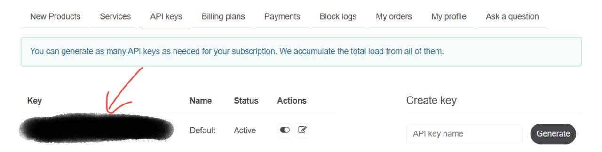
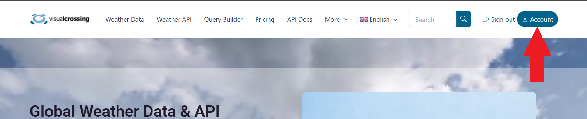
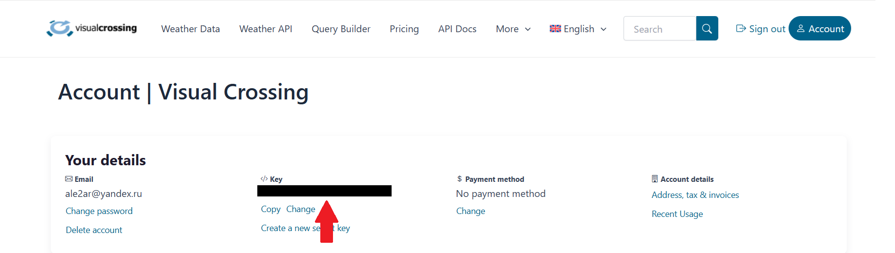
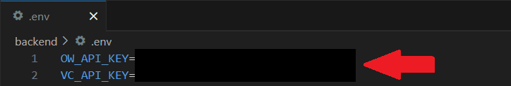
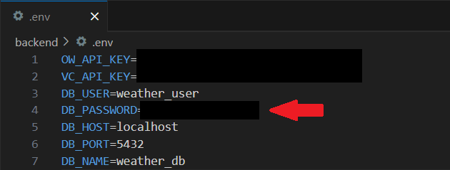

1. Создаём виртуальное окружение Python в папке venv: python -m venv venv
2. Разрешаем выполнение локальных скриптов в PowerShell(для Windows): Set-ExecutionPolicy RemoteSigned -Scope Process
3. Активируем виртуальное окружение из папки venv: .\venv\Scripts\activate (для Windows), source venv/bin/activate (для Linux/Mac)
4. Устанавливаем все необходимые пакеты: pip install -r requirements.txt
5. Зарегистрироваться на сайте OpenWeather для получения собственного API ключа: http://api.openweathermap.org

6. Зарегистрироваться на сайте Visual Crossing для получения собственного API ключа: https://www.visualcrossing.com

7. Создать файл .env, куда нужно будеть вставить свои API ключи.

8. Создание базы данных и пользователя: sudo -u postgres psql(для Linux/Mac) psql -U postgres(для Windows)
CREATE DATABASE weather_db;
CREATE USER weather_user WITH PASSWORD 'weather_password';
GRANT ALL PRIVILEGES ON DATABASE weather_db TO weather_user;
ALTER DATABASE weather_db OWNER TO weather_user;
9. Добавить в файл .env свой пароль для подключения к базе данных.

10. Запустить приложение: python app.py