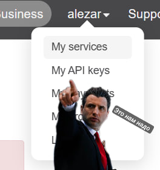
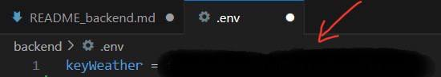

1. Создаём виртуальное окружение Python в папке venv: python -m venv venv
2. Разрешаем выполнение локальных скриптов в PowerShell(для Windows): Set-ExecutionPolicy RemoteSigned -Scope Process
3. Активируем виртуальное окружение из папки venv: .\venv\Scripts\activate (для Windows), source venv/bin/activate (для Linux/Mac)
4. Устанавливаем все необходимые пакеты: pip install -r requirements.txt
5. Зарегистрироваться на сайте OpenWeather для получения собственного API ключа: http://api.openweathermap.org

6. Создать файл .env, куда нужно будеть вставить свой API ключ.

7. Запустить приложение: flask run.